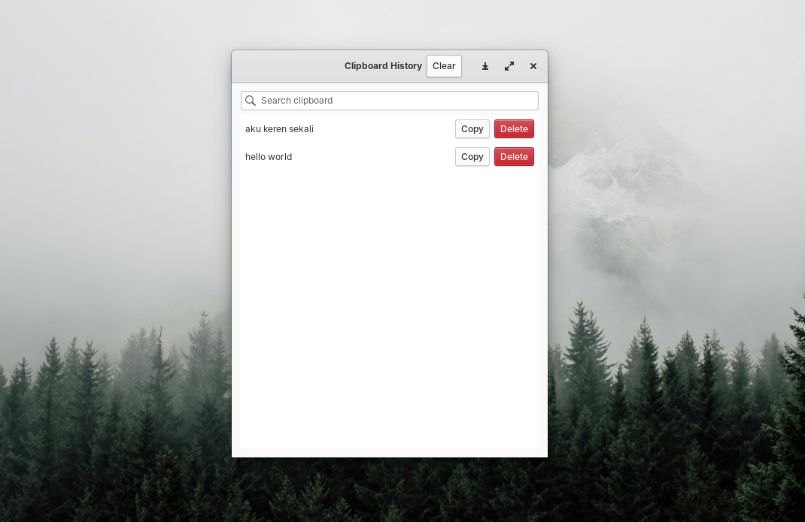

# Clipboard History for elementary OS

A lightweight clipboard history manager built for Linux desktops using GTK and Granite.
This application automatically stores copied text and allows you to quickly search, reuse, and manage clipboard items.

Designed to integrate well with elementary OS style and workflows.

## Features

* Automatic clipboard monitoring
* Clipboard history list
* Search clipboard history
* Copy previous clipboard items with one click
* Delete individual history items
* Clear all clipboard history
* Automatic history limit (old items are removed automatically)
* Simple and clean GTK interface

## Screenshot



## Requirements

* GTK 3
* Granite
* Gee (collections library)
* Vala compiler

Install dependencies on Ubuntu / elementary OS:

```bash
sudo apt install valac libgtk-3-dev libgranite-dev libgee-0.8-dev
```

## Build

Clone the repository and compile the project using `valac`.

```bash
git clone https://github.com/gylangsatria/clipboard-history-elementaryos.git
cd clipboard-history-elementaryos

valac src/*.vala \
--pkg gtk+-3.0 \
--pkg granite \
--pkg gee-0.8
```

## Run

After compiling, run the application:

```bash
./main
or 
./clipboard-manager
```

## Project Structure

```
clipboard-history-elementaryos
 ├── src
 │   ├── main.vala
 │   ├── window.vala
 │   └── clipboard-manager.vala
 └── README.md
```

## How It Works

The application monitors the system clipboard periodically.
Whenever new text is copied, it is stored in an internal history list.

Users can:

* search the clipboard history
* copy previous entries
* remove unwanted entries
* clear the entire history

A maximum history size prevents unlimited memory usage.

## Future Improvements

Possible improvements for future versions:

* Wingpanel indicator integration
* Clipboard popup similar to Windows Win+V
* Image clipboard support
* Persistent history using SQLite
* Global keyboard shortcuts
* Pinned clipboard items

## License

MIT License
